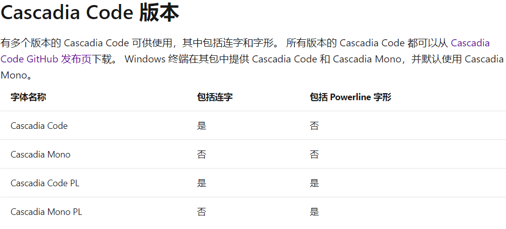
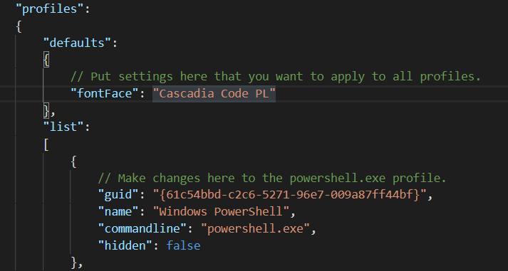

## 环境与问题说明

- **环境**：WSL2 -Ubuntu + Windows Terminal + zsh + agnoster主题

- **遇到的问题**：无法正确显示命令提示符

  

## 出现原因

缺少PowerLine字体，一些符号显示不正常。

## 解决办法

安装包括 Powerline 字形的字体，进行Windows Terminal字体设置

> 网上很多教程都是关于Linux平台下的解决办法，但是在WSL2+Windows Terminal的环境中，我们应该在Windows中安装字体，而不是在WSL2中的Ubuntu中安装。

### 安装字体

包括 Powerline 字形的字体有很多，我选择的是Cascadia Code PL. 因为Windows Terminal默认使用Cascadia  Mono字体还挺好看的，所以选择了它的带连字功能、带 Powerline 字形的版本。它的四种字体区别如下，介绍的[原链接](https://docs.microsoft.com/zh-cn/windows/terminal/cascadia-code)是微软的。字体地址：https://github.com/microsoft/cascadia-code/releases ,选择自己喜欢的安装即可。

### 修改Windows终端设置

打开Windows Terminal，按下ctrl+','打开设置文件settings.json，添加`"fontFace": "Cascadia Code PL"`一行，如果想设置通过 Terminal打开的窗口都使用这个字体，就和我一样在"defaults"一栏中添加；如果想为打开的cmd或者其他窗口单独设置字体，就在下面的"list"一栏中和guid,name等项并列添加（注意添加逗号）。更改设置文件后，Terminal会实时更新设置，无需重启。如果添加的字体未找到，则Terminal将使用Consolas字体。

> 注意：这里的settings.json就是原来的profiles.json文件，在[一次四月份的更改](https://github.com/microsoft/terminal/issues/5458)中改名。同时，原来的"globals"也已被舍弃。

## 最终效果

虽然能够正常显示了，但感觉好像还是没有在Linux环境下那么好看。

## 参考教程

[官方Profile设置说明](https://docs.microsoft.com/en-us/windows/terminal/customize-settings/profile-settings)

[在 Windows 终端中设置 Powerline](https://docs.microsoft.com/zh-cn/windows/terminal/tutorials/powerline-setup)

[三款代码字体：Fira Code、JetBrains Mono 与 Cascadia Code](https://zhuanlan.zhihu.com/p/116230037)

[Cascadia Code](https://docs.microsoft.com/zh-cn/windows/terminal/cascadia-code)